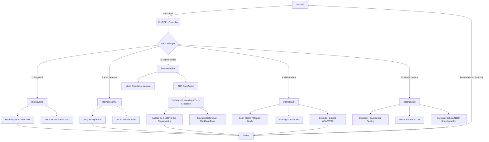

# Ajin (CLI-PING)

> **DISCLAIMER:** ESSA FERRAMENTA E OPEN SOURCE E FOCADA PARA PENTEST E SEGURANÇA DEFENSIVA E SO TEM FINS DE CONHECIMENTO.

Ajin (anteriormente CLI-Ping) é uma ferramenta abrangente baseada em linha de comando interativa (REPL), escrita em Golang, projetada para testes de rede, sniffing passivo, ataques Man-in-the-Middle (ARP Spoofing), auditoria de redes WiFi e extração de credenciais Windows (SAM).

## Sistemas Operacionais Suportados

O Ajin foi desenhado para ser multiplataforma, no entanto, devido à natureza de baixo nível de manipulação de pacotes, o comportamento e os requisitos variam:
- **Windows (Primário):** Suporte nativo e completo à maioria das funções de rede, sniffing (via Npcap) e cracking. (Requer execução como **Administrador**). O módulo de captura passiva WiFi é limitado a adaptadores específicos.
- **Linux (Debian/Kali/Ubuntu):** Suporte total. Fortemente recomendado para captura ativa de WiFi (Monitor Mode). (Requer execução como **root**).
- **macOS:** Suporte parcial. Módulos de rede padrão operam normalmente, porém funcionalidades invasivas de ARP e injeção de pacotes podem ser bloqueadas pelas diretrizes do Kernel Darwin (XNU).

## Como Baixar e Executar (Getting Started)

### 1. Pré-Requisitos de Ambiente
Antes de rodar a ferramenta, certifique-se de que o sistema possui os seguintes pacotes:
- **[Golang](https://go.dev/dl/)** (versão 1.20 ou superior).
- **No Windows:** Instale o **[Npcap](https://npcap.com/)** (Motor essencial para o módulo de Sniffer/MitM). *Nota: Marque a opção "Install Npcap in WinPcap API-compatible Mode" durante a instalação.*
- **No Linux:** Instale as bibliotecas de compilação de pacotes C (libpcap):
  ```bash
  sudo apt-get update
  sudo apt-get install libpcap-dev
  ```

### 2. Download (Clonando o Repositório)
Abra seu terminal e baixe o código fonte através do Git:
```bash
git clone https://github.com/gabrifranca/cli_ping.git
cd cli_ping
```

### 3. Instalando as Dependências
O projeto gerencia suas bibliotecas automaticamente via Go Modules. Para sincronizar e baixar todas as dependências de terceiros (como `gopacket`), execute:
```bash
go mod tidy
```

### 4. Compilando e Executando
Para que o sistema operacional permita a abertura de "Raw Sockets" (necessários para pings ICMP reais e injeção de pacotes ARP), o Ajin **deve** ser iniciado com privilégios máximos.

**No Windows (Abra o PowerShell ou CMD executando como Administrador):**
```powershell
# Opção A: Executar diretamente
go run main.go

# Opção B: Compilar para um executável portável e executá-lo
go build -o ajin.exe main.go
.\ajin.exe
```

**No Linux (Terminal):**
```bash
# Compilar o binário localmente
go build -o ajin main.go

# Executar como Superusuário (root)
sudo ./ajin
```

## Arquitetura Utilizada

O projeto utiliza uma arquitetura em camadas (Layered Architecture) com inspirações de Clean Architecture / Hexagonal, separando a lógica de negócios da interface e integrações:

- **`cmd/cli` (Controller/Presentation):** Ponto de entrada do sistema. Gerencia o REPL (Read-Eval-Print Loop) interativo e orquestra chamadas aos serviços internos.
- **`internal/domain` (Core/Interfaces):** Define as estruturas de dados (`PingResult`, `HashcatConfig`, `NTLMHash`, etc.) e interfaces de contrato (`Pinger`, `Scanner`, `Sniffer`).
- **`internal/ping` (Service):** Implementa a lógica de teste de conectividade HTTP/ICMP e verificação de certificados TLS.
- **`internal/scanner` (Service):** Lida com varreduras ativas, Port Scan remoto e local, Ping Sweep (`NetworkScan`), testes de carga e utilitários como decodificador JWT e DNS Lookup.
- **`internal/sniffer` (Service):** Camada de baixo nível de rede usando `gopacket`. Implementa escuta passiva, OS Fingerprinting passivo, MitM (ARP Spoofing), roteamento Zero-Allocation (Software Forwarding) e interrupção de serviço (Black Hole/Software Drop).
- **`internal/sam` (Service):** Módulo focado na extração e parsing de arquivos SAM e SYSTEM do Windows para coletar e estruturar hashes NTLM.
- **`internal/wifi` (Service):** Integração e varredura de redes sem fio. Orquestra a captura de handshakes EAPOL e gerencia a execução do Hashcat para auditoria de senhas.
- **`internal/report` (Infrastructure):** Módulo responsável pela gravação de dados em disco (ex: `log_rede.txt`, `log_https.txt`).
- **`view` (Presentation):** Concentra a lógica visual, renderização de tabelas, menus em arte ASCII e cores no terminal.

## Árvore do Projeto (Project Tree)

```text
cli_ping/
├── cmd/
│   └── cli/
│       ├── cli.go           # Controlador central, Menus principais e REPL
│       └── sam_menu.go      # Submenu de extração e ataque a SAM/NTLM
├── internal/
│   ├── domain/
│   │   ├── interfaces.go    # Contratos de serviços de rede (Pinger, Scanner, etc)
│   │   └── models.go        # Estruturas de dados globais
│   ├── ping/
│   │   └── service.go       # Ping HTTP e verificação TLS
│   ├── report/
│   │   └── writer.go        # Gravação de logs
│   ├── sam/
│   │   ├── guide.go         # Guias de instrução CLI para SAM offline
│   │   ├── models.go        # Modelos estruturais de NTLM
│   │   └── parser.go        # Lógica de integração com secretsdump/samdump2
│   ├── scanner/
│   │   └── service.go       # Varredura ativa, DNS, Load Testing, Local Scan
│   ├── sniffer/
│   │   ├── analyzer.go      # Geração de relatório de análise de pacotes e SO
│   │   ├── capture.go       # Captura de pacotes (gopacket) e ARP Spoof (MitM)
│   │   ├── device_db.go     # Gerenciamento de persistência de MACs/SOs conhecidos
│   │   ├── network.go       # ARP Sweep, Envenenamento e BlackHole Network Control
│   │   └── parser.go        # Decodificadores de protocolo rasos (TLS SNI, HTTP Host)
│   └── wifi/
│       ├── capture.go       # Lida com captura de handshakes (hcxdumptool/gopacket)
│       ├── hashcat.go       # Abstração de execução e flags para Hashcat
│       └── wifi.go          # Serviço de rastreio de redes (netsh/nmcli)
├── view/
│   └── printer.go           # Saídas formatadas com ANSI codes
├── main.go                  # Entrypoint principal da aplicação
├── LICENSE                  # MIT License
├── go.mod                   # Gerenciamento de pacotes Go
└── README.md                # Documentação
```

## Fluxo de Operação (Flow Diagram)



## Requisitos para Funcionalidades (Requirements)

1. **Ping, TLS, DNS Lookup, Load Testing, e JWT Decoder**:
   - Conexão nativa de rede (Internet).
   - Sem necessidade de privilégios especiais.
   
2. **Scanner Ativo de Rede / Portas**:
   - Conexão local na rede que deseja rastrear.
   - Restrição natural de firewalls de rede/SO que podem dropar pacotes SYN.

3. **Sniffer de Rede e MitM (ARP Spoofing)**:
   - **SO:** Windows ou Linux.
   - **Drivers:** `Npcap` instalado no Windows (ou `libpcap` no Linux/macOS).
   - **Permissões:** Obrigatório rodar como Administrador / `root`.

4. **WiFi Auditor (Captura e Cracking)**:
   - Placa de rede compatível com o "Modo Monitor" e injeção de pacotes (para captura ativa WPA2).
   - Ferramentas no SO: `hcxdumptool` e `hcxtools` (para a conversão pcapng -> hc22000).
   - Software: Hashcat devidamente instalado (e preferencialmente drivers OpenCL GPU para máxima performance de quebra).

5. **SAM Extractor (Parsing NTLM)**:
   - Acesso prévio aos arquivos SAM e SYSTEM, quer por Boot USB offline (Linux/Live CD) ou acesso `Admin` pelo Windows via Reg Save.
   - Ferramentas de Parser Python/C instaladas no sistema hospedeiro: `impacket-secretsdump`, standalone `secretsdump.exe` ou `samdump2`.
   - Hashcat para realizar o Brute-force local.

## Possíveis Bugs e Efeitos Colaterais (Side Effects)

1. **ARP Spoofing (Man-in-the-Middle):**
   - **Efeito colateral:** Roteadores e firewalls corporativos avançados (IDS/IPS) podem detectar a inundação ARP (ARP Flooding) ou falsificação, possivelmente banindo o endereço MAC do atacante e gerando alertas na rede.
   - **Bugs:** Se a ferramenta for fechada abruptamente (força bruta, `SIGKILL`, crash), os pacotes de "ARP Restore" não serão disparados. Isso deixará o cache ARP do alvo envenenado até que expire, isolando o alvo da internet.
   
2. **Black Hole e Software Drop:**
   - **Efeito colateral:** Na funcionalidade defensiva, ativar o Bloqueio corta completamente a internet e intranet da máquina alvo, uma vez que descarta todos os frames no host rodando o Ajin.
   
3. **OS Fingerprinting Inconsistente:**
   - **Bugs:** O Fingerprint Baseado em TTL pode ser corrompido ou falseado facilmente. IPs em sub-redes remotas chegando via vários hops reduzem o TTL artificialmente. Técnicas ativas não garantem 100% de exatidão.
   
4. **Captura WiFi Limitada (Windows):**
   - **Bugs/Limitante:** Bibliotecas pcap no Windows têm dificuldade com a maioria dos drivers de placa wireless para ativar o "Modo Monitor". A captura de handshakes via `hcxdumptool` é projetada majoritariamente para instâncias Linux (Kali).

5. **Falha de Inicialização Hashcat:**
   - O Hashcat requer mapeamento correto de diretórios e drivers de vídeo (OpenCL/CUDA) devidamente configurados. Um downgrade do driver, ausência, ou caminhos absolutos divergentes podem abortar o processo com erros na CLI.

## Bibliotecas e Dependências (Libraries Used)

O projeto baseia-se fortemente nas seguintes bibliotecas externas (Go Modules):

1. **`github.com/google/gopacket` (v1.1.19)**:
   - **Propósito:** Captura, injeção e decodificação de pacotes de rede (Packet Crafting & Sniffing).
   - **Uso no Projeto:** Fornece as abstrações das camadas OSI (Ethernet, IPv4, TCP, UDP, ICMP, DNS). É o motor por trás do módulo `sniffer`, permitindo a leitura no modo promíscuo via adaptadores como Npcap/libpcap e a construção de frames brutos para ataques ativos de MitM.

2. **`github.com/timest/gomanuf` (v0.0.0)**:
   - **Propósito:** Resolução de Endereços MAC para Identificação de Fabricante (OUI - Organizationally Unique Identifier).
   - **Uso no Projeto:** Utilizado no módulo `sniffer` durante a fase de análise (OS Fingerprinting e relatórios passivos) para mapear os 3 primeiros octetos de um endereço MAC capturado (ex: `70:a8:d3:xx:xx:xx`) e inferir de qual corporação/fabricante o hardware pertence (ex: Apple, Samsung, Intel).

## Análise Acadêmica e Teórica dos Módulos

Esta seção destrincha, sob uma ótica acadêmica e de redes de computadores, o funcionamento das rotinas centrais implementadas no código, incluindo exemplos práticos do fluxo subjacente.

### 1. Roteamento de Falsificação de ARP (Man-in-the-Middle)
**Módulo:** `internal/sniffer/network.go` | **Funções:** `sendARPReply` / `ARPSpoofMitM`
- **Teoria:** O protocolo ARP (Address Resolution Protocol - RFC 826) é um mecanismo sem estado (*stateless*). Ele confia inerentemente nas respostas da rede e não possui autenticação nativa.
- **Implementação:** O algoritmo constrói (*crafting*) um frame `EthernetTypeARP` usando a biblioteca `gopacket`. Ele informa o Endereço IP do Gateway (ex: `192.168.1.1`) no campo `SourceProtAddress`, mas preenche o campo `SourceHwAddress` (MAC) com o endereço físico da máquina atacante. 
- **Exemplo Prático:** 
  - *Vítima:* 192.168.1.50 (MAC: `AA:AA:AA:AA:AA:AA`)
  - *Gateway:* 192.168.1.1 (MAC: `BB:BB:BB:BB:BB:BB`)
  - *Atacante:* 192.168.1.100 (MAC: `CC:CC:CC:CC:CC:CC`)
  - O atacante envia para a Vítima um frame ARP Reply dizendo: *"O IP 192.168.1.1 agora está no MAC CC:CC:CC:CC:CC:CC"*.
- **Efeito:** A tabela ARP da vítima é envenenada. O tráfego destinado à Internet flui primeiro para o atacante, concretizando o sequestro.

### 2. Zero-Allocation Software Forwarding
**Módulo:** `internal/sniffer/capture.go` | **Rotina:** Loop principal de captura e roteamento.
- **Teoria:** Se o tráfego interceptado não for repassado para o roteador, a vítima sofrerá um DoS (Denial of Service). Tradicionalmente, usa-se `IP Forwarding` do Kernel.
- **Implementação:** Para evitar detecções de TTL alterado e não depender de configurações do SO, o Ajin usa Roteamento por Software *in-memory*.
- **Exemplo Prático:** 
  - O sniffer captura um pacote de `192.168.1.50` com destino a `8.8.8.8`. O frame Ethernet de origem chega com o MAC de destino igual a `CC:CC:CC:CC:CC:CC` (Atacante).
  - O código Go modifica em memória (`data[0:6]`) o MAC de destino para o MAC real do Gateway (`BB:BB:BB:BB:BB:BB`) e injeta na rede. A vítima não percebe atraso graças à ausência de *Garbage Collection* no processo.

### 3. Fingerprinting Passivo de Sistema Operacional (Passive OS Fingerprinting)
**Módulo:** `internal/sniffer/capture.go` e `internal/sniffer/analyzer.go`
- **Teoria:** Diferentes stacks TCP/IP inicializam o *Time To Live* (TTL) do IPv4 de forma distinta (Linux: 64, Windows: 128, Redes: 255). Além disso, pacotes DHCP Broadcast (UDP/67) possuem a Opção 55 (Parameter Request List) única por SO.
- **Implementação e Exemplo Prático:** 
  - Quando um pacote de `192.168.1.50` é dissecado e o `TTL` é `128`, a heurística primária aponta para "Windows".
  - Se o `analyzer.go` capta uma query DNS (UDP/53) para o domínio `msftconnecttest.com`, o fingerprinting confirma com 100% de precisão que o alvo opera Windows (devido ao NCSI - Network Connectivity Status Indicator). 
  - Se for para `captive.apple.com` e TTL 64, confirma iOS/MacOS.

### 4. Buraco Negro de Rede (ARP Black Hole / Software Drop)
**Módulo:** `internal/sniffer/network.go` | **Função:** `SendARPBlackhole`
- **Teoria:** O *Null Routing* descarta tráfego em hardware.
- **Implementação e Exemplo Prático:** A ferramenta injeta pacotes ARP cravando que o IP do Gateway reside no MAC inexistente `de:ad:be:ef:00:01`. 
  - A vítima (`192.168.1.50`) tenta acessar o Google. Envia os frames para `de:ad:be:ef:00:01`.
  - O Switch L2 analisa sua tabela CAM, não acha a porta deste MAC, faz um flood ou o descarta diretamente. A vítima sofre um isolamento furtivo da rede.

### 5. Extração e Cracking de Hashes NTLM do Windows (SAM)
**Módulo:** `internal/sam/parser.go` e `internal/wifi/hashcat.go`
- **Teoria:** O Windows salva hashes locais de usuários (NTLM) na SAM, protegidos pela chave *SYSKEY*. O NTLM usa o algoritmo *MD4* sem adição de *salting*, sendo altamente vulnerável à aceleração GPU (Dicionário ou Força Bruta).
- **Implementação:** O módulo interage com saídas de ferramentas binárias (ex: impacket-secretsdump) para estruturar os dados.
- **Exemplo Prático:** 
  - O dump exporta o formato: `Administrador:500:aad3b435b51404eeaad3b435b51404ee:31d6cfe0d16ae931b73c59d7e0c089c0:::`
  - O Ajin extrai apenas o sufixo NTLM (`31d6cfe...`) e invoca: `hashcat.exe -m 1000 hashes.txt -a 3 ?d?d?d?d?d?d`
  - A placa de vídeo (OpenCL/CUDA) executa permutações vetoriais, descobrindo matematicamente a senha original subjacente.

### 6. Scanner Ativo, Ping Sweep e Validação TLS (Network & Ping)
**Módulo:** `internal/scanner/service.go` e `internal/ping/service.go`
- **Teoria:** O mapeamento topológico em Redes de Computadores requer envio de tráfego ICMP (Ping) ou TCP SYN/Connect para inferir o estado de *hosts* e portas lógicas. No caso do TLS, envolve o aperto de mãos (*Handshake*) na camada de Apresentação (OSI) para resgatar os certificados x509.
- **Implementação e Exemplo Prático:**
  - **Ping Sweep (ICMP/TCP):** A ferramenta itera sobre o bloco CIDR (ex: `192.168.1.0/24`), enviando `ICMP Echo Request`. Dispositivos que respondem com `Echo Reply` são marcados como ALIVE.
  - **Port Scanner:** O Ajin faz conexões TCP bidirecionais simultâneas usando goroutines (`net.DialTimeout`). 
    - *Exemplo:* Tenta conectar em `192.168.1.1:80`. Se retornar `SYN-ACK`, porta `Open`. Se retornar `RST`, `Closed`. Se timeout, `Filtered`.
  - **Certificado TLS:** A função abre um socket `tls.Dial` na porta 443 do alvo, extrai a cadeia de certificados do `PeerCertificates` e processa a expiração (matemática entre data atual e *NotAfter*), alertando certificados expirados e mitigando exploração de criptografia legada.

### 7. Captura WPA/WPA2 e Auditoria WiFi
**Módulo:** `internal/wifi/capture.go` e `internal/wifi/wifi.go`
- **Teoria:** O protocolo 802.11i (WPA2-PSK) protege conexões estabelecendo uma chave temporária através de um *4-Way Handshake* EAPOL. Atacantes que capturam o handshake completo podem submetê-lo a um ataque de quebra offline baseando-se no dicionário derivado de algoritmos PBKDF2.
- **Implementação e Exemplo Prático:**
  - O `wifi.go` invoca comandos de sistema como `netsh/nmcli` para ler beacons 802.11 e listar os BSSIDs e canais presentes no ar.
  - A ferramenta coordena a injeção ativa via `hcxdumptool` ou sniffing passivo via `gopacket`. Quando um cliente legítimo (como um celular) se conecta ao roteador alvo, os 4 quadros do handshake são interceptados e gravados em um arquivo `.pcapng`.
  - A rotina usa utilitários locais (`hcxpcapngtool`) para converter o `.pcapng` interceptado em formato `.hc22000`, próprio para matrizes de aceleração. Em seguida, aciona o Hashcat no modo dedicado WPA (`-m 22000`), injetando *wordlists* (Dicionário) ou máscaras de Força Bruta para descobrir e auditar a segurança da chave PSK.

## Licença

Este projeto é disponibilizado sob a **Licença MIT**. Para mais detalhes, veja o arquivo [LICENSE](./LICENSE).
